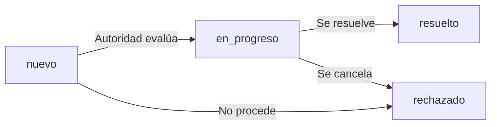
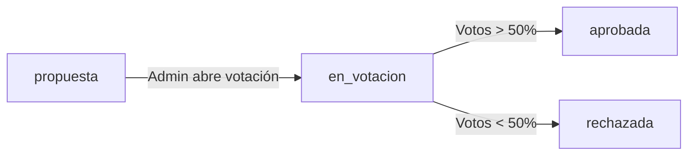

# Documentación de Base de Datos - Mapeo Vecinal

## Resumen Ejecutivo

La base de datos de Mapeo Vecinal está diseñada con 5 entidades principales conectadas mediante relaciones de foreign keys que garantizan la integridad referencial. Utiliza **soft deletes** para preservar historial y admite **paginación y filtros** en todas las consultas críticas.

---

## 1. Tabla: `usuarios`

**Propósito**: Almacenar información de todos los usuarios de la plataforma

### Estructura

| Campo | Tipo | Restricciones | Descripción |
|-------|------|---------------|-------------|
| `id` | INT | PRIMARY KEY, AUTO_INCREMENT | Identificador único |
| `nombre` | VARCHAR(100) | NOT NULL | Nombre completo del usuario |
| `email` | VARCHAR(100) | UNIQUE, NOT NULL | Email único para login |
| `password` | VARCHAR(255) | NOT NULL | Hash bcrypt de la contraseña |
| `rol` | ENUM | DEFAULT 'ciudadano' | Rol: ciudadano, autoridad, admin |
| `barrio` | VARCHAR(100) | NOT NULL | Barrio o localidad del usuario |
| `estado` | ENUM | DEFAULT 'activo' | Estado: activo, inactivo |
| `created_at` | TIMESTAMP | DEFAULT CURRENT_TIMESTAMP | Fecha de creación |
| `updated_at` | TIMESTAMP | ON UPDATE CURRENT_TIMESTAMP | Última actualización |
| `deleted_at` | TIMESTAMP | NULL | Soft delete (NULL = activo) |

### Índices

```sql
PRIMARY KEY (id)
UNIQUE KEY (email)
INDEX (rol)
INDEX (barrio)
INDEX (estado)
```

### Ejemplos de Datos

```json
{
  "id": 1,
  "nombre": "Juan García",
  "email": "juan@ejemplo.com",
  "password": "$2y$10$...",
  "rol": "ciudadano",
  "barrio": "Centro",
  "estado": "activo",
  "created_at": "2026-06-10 10:30:00",
  "updated_at": "2026-06-10 10:30:00",
  "deleted_at": null
}
```

---

## 2. Tabla: `categorias`

**Propósito**: Clasificar reportes y propuestas por tipo

### Estructura

| Campo | Tipo | Restricciones | Descripción |
|-------|------|---------------|-------------|
| `id` | INT | PRIMARY KEY, AUTO_INCREMENT | Identificador único |
| `nombre` | VARCHAR(50) | UNIQUE, NOT NULL | Nombre de la categoría |
| `icono` | VARCHAR(50) | DEFAULT 'folder' | Clase de icono (Font Awesome) |
| `color` | VARCHAR(7) | DEFAULT '#3498db' | Código hexadecimal del color |
| `descripcion` | TEXT | NULL | Descripción detallada |
| `created_at` | TIMESTAMP | DEFAULT CURRENT_TIMESTAMP | Fecha de creación |

### Categorías Predefinidas

1. **Infraestructura** (#e74c3c) - Calles, vías, puentes
2. **Seguridad** (#9b59b6) - Delincuencia, vigilancia
3. **Alumbrado** (#f39c12) - Iluminación pública
4. **Limpieza** (#16a085) - Espacios públicos sucios
5. **Servicios Públicos** (#3498db) - Agua, gas, energía
6. **Transporte** (#2980b9) - Buses, vías de acceso
7. **Espacios Verdes** (#27ae60) - Parques, jardines
8. **Educación** (#8e44ad) - Escuelas, colegios
9. **Salud** (#c0392b) - Hospitales, centros médicos
10. **Otros** (#7f8c8d) - Categoría genérica

---

## 3. Tabla: `reportes`

**Propósito**: Almacenar problemas reportados por ciudadanos

### Estructura

| Campo | Tipo | Restricciones | Descripción |
|-------|------|---------------|-------------|
| `id` | INT | PRIMARY KEY, AUTO_INCREMENT | Identificador único |
| `titulo` | VARCHAR(150) | NOT NULL | Título breve del problema |
| `descripcion` | TEXT | NOT NULL | Descripción detallada |
| `estado` | ENUM | DEFAULT 'nuevo' | Estado: nuevo, en_progreso, resuelto, rechazado |
| `latitud` | DECIMAL(10,8) | NULL | Coordenada GPS |
| `longitud` | DECIMAL(11,8) | NULL | Coordenada GPS |
| `foto` | VARCHAR(255) | NULL | Path de foto evidencia |
| `user_id` | INT | NOT NULL | FK → usuarios(id) |
| `categoria_id` | INT | NOT NULL | FK → categorias(id) |
| `votos_totales` | INT | DEFAULT 0 | Contador de votaciones |
| `created_at` | TIMESTAMP | DEFAULT CURRENT_TIMESTAMP | Fecha de reporte |
| `updated_at` | TIMESTAMP | ON UPDATE CURRENT_TIMESTAMP | Última actualización |
| `deleted_at` | TIMESTAMP | NULL | Soft delete |

### Índices

```sql
PRIMARY KEY (id)
FOREIGN KEY (user_id) REFERENCES usuarios(id) ON DELETE CASCADE
FOREIGN KEY (categoria_id) REFERENCES categorias(id) ON DELETE CASCADE
INDEX (estado, created_at)
INDEX (user_id)
INDEX (categoria_id)
INDEX (votos_totales DESC)
```

### Estados de Ciclo de Vida



---

## 4. Tabla: `propuestas`

**Propósito**: Almacenar propuestas de mejoras para el barrio

### Estructura

| Campo | Tipo | Restricciones | Descripción |
|-------|------|---------------|-------------|
| `id` | INT | PRIMARY KEY, AUTO_INCREMENT | Identificador único |
| `titulo` | VARCHAR(150) | NOT NULL | Título de la propuesta |
| `descripcion` | TEXT | NOT NULL | Descripción detallada |
| `estado` | ENUM | DEFAULT 'propuesta' | Estado: propuesta, en_votacion, aprobada, rechazada |
| `user_id` | INT | NOT NULL | FK → usuarios(id) |
| `categoria_id` | INT | NOT NULL | FK → categorias(id) |
| `votos_totales` | INT | DEFAULT 0 | Contador de votos a favor |
| `created_at` | TIMESTAMP | DEFAULT CURRENT_TIMESTAMP | Fecha de creación |
| `updated_at` | TIMESTAMP | ON UPDATE CURRENT_TIMESTAMP | Última actualización |
| `deleted_at` | TIMESTAMP | NULL | Soft delete |

### Índices

```sql
PRIMARY KEY (id)
FOREIGN KEY (user_id) REFERENCES usuarios(id) ON DELETE CASCADE
FOREIGN KEY (categoria_id) REFERENCES categorias(id) ON DELETE CASCADE
INDEX (estado, votos_totales DESC)
```

### Estados de Ciclo de Vida



---

## 5. Tabla: `votaciones`

**Propósito**: Registrar votos de usuarios en propuestas

### Estructura

| Campo | Tipo | Restricciones | Descripción |
|-------|------|---------------|-------------|
| `id` | INT | PRIMARY KEY, AUTO_INCREMENT | Identificador único |
| `user_id` | INT | NOT NULL | FK → usuarios(id) |
| `propuesta_id` | INT | NOT NULL | FK → propuestas(id) |
| `tipo_voto` | ENUM | DEFAULT 'favor' | Tipo: favor, contra |
| `fecha` | TIMESTAMP | DEFAULT CURRENT_TIMESTAMP | Fecha del voto |

### Restricciones Únicas

```sql
UNIQUE KEY unique_voto (user_id, propuesta_id)
```

**Garantía**: Un usuario solo puede votar UNA VEZ por propuesta

### Índices

```sql
PRIMARY KEY (id)
FOREIGN KEY (user_id) REFERENCES usuarios(id) ON DELETE CASCADE
FOREIGN KEY (propuesta_id) REFERENCES propuestas(id) ON DELETE CASCADE
UNIQUE KEY (user_id, propuesta_id)
```

---

## Relaciones y Diagrama ER

```sql
USUARIOS (1) ──────→ (N) REPORTES
    │                    │
    │                    └──→ (1) CATEGORIAS
    │
    ├──────→ (N) PROPUESTAS
    │            │
    │            └──→ (1) CATEGORIAS
    │
    └──────→ (N) VOTACIONES ──→ (1) PROPUESTAS
```

### Cardinalidades

| Relación | Tipo | Comportamiento |
|----------|------|----------------|
| Usuario → Reportes | 1:N | ON DELETE CASCADE |
| Usuario → Propuestas | 1:N | ON DELETE CASCADE |
| Usuario → Votaciones | 1:N | ON DELETE CASCADE |
| Categoría → Reportes | 1:N | ON DELETE CASCADE |
| Categoría → Propuestas | 1:N | ON DELETE CASCADE |
| Propuesta → Votaciones | 1:N | ON DELETE CASCADE |

---

## Consultas Optimizadas Comunes

### 1. Obtener todos los reportes con detalles del usuario

```sql
SELECT 
    r.*,
    u.nombre,
    u.email,
    u.barrio,
    c.nombre as categoria_nombre,
    c.color
FROM reportes r
JOIN usuarios u ON r.user_id = u.id
JOIN categorias c ON r.categoria_id = c.id
WHERE r.deleted_at IS NULL
ORDER BY r.created_at DESC
LIMIT 10;
```

### 2. Obtener propuestas más votadas en votación

```sql
SELECT 
    p.*,
    u.nombre,
    COUNT(v.id) as total_votos
FROM propuestas p
LEFT JOIN usuarios u ON p.user_id = u.id
LEFT JOIN votaciones v ON p.id = v.propuesta_id AND v.tipo_voto = 'favor'
WHERE p.estado = 'en_votacion' AND p.deleted_at IS NULL
GROUP BY p.id
ORDER BY total_votos DESC;
```

### 3. Obtener resumen de votación de propuesta

```sql
SELECT 
    tipo_voto,
    COUNT(*) as cantidad,
    (COUNT(*) * 100.0 / (
        SELECT COUNT(*) FROM votaciones WHERE propuesta_id = ?
    )) as porcentaje
FROM votaciones
WHERE propuesta_id = ?
GROUP BY tipo_voto;
```

### 4. Obtener reportes por barrio y estado

```sql
SELECT 
    c.nombre as categoria,
    r.estado,
    COUNT(r.id) as cantidad
FROM reportes r
JOIN usuarios u ON r.user_id = u.id
JOIN categorias c ON r.categoria_id = c.id
WHERE u.barrio = ? AND r.deleted_at IS NULL
GROUP BY c.id, r.estado;
```

---

## Estrategia de Soft Deletes

Se implementan soft deletes en las tablas de **usuarios**, **reportes** y **propuestas** para:

1. Preservar historial y auditoría
2. Mantener integridad referencial
3. Permitir recuperación de datos eliminados

**Implementación**: Campo `deleted_at` que es NULL cuando el registro está activo

```sql
-- Ver solo activos
WHERE deleted_at IS NULL

-- Ver solo eliminados
WHERE deleted_at IS NOT NULL

-- Restaurar registro
UPDATE usuarios SET deleted_at = NULL WHERE id = ?
```

---

## Migraciones

Las migraciones de CodeIgniter 4 están versionadas:

- `2026-06-10-000001_CreateUsuarios.php`
- `2026-06-10-000002_CreateCategorias.php`
- `2026-06-10-000003_CreateReportes.php`
- `2026-06-10-000004_CreatePropuestas.php`
- `2026-06-10-000005_CreateVotaciones.php`

Ejecutar todas las migraciones:
```bash
php spark migrate
```

---

## Seeders

Se proporcionan dos seeders para datos iniciales:

1. **UsuarioSeeder**: Crea 8 usuarios (1 admin, 2 autoridades, 5 ciudadanos)
2. **CategoriaSeeder**: Crea 10 categorías predefinidas

```bash
php spark db:seed UsuarioSeeder
php spark db:seed CategoriaSeeder
```

---

## Backups y Mantenimiento

### Backup completo
```bash
mysqldump -u root -p mapeo_vecinal > backup_mapeo_vecinal_$(date +%Y%m%d).sql
```

### Restaurar desde backup
```bash
mysql -u root -p mapeo_vecinal < backup_mapeo_vecinal_20260610.sql
```

---

## Performance Tips

1. **Índices**: Todos en lugar para campos de búsqueda
2. **Paginación**: Implementada en todos los endpoints
3. **Lazy Loading**: Cargar categorías bajo demanda
4. **Caching**: Considerar Redis para categorías (cambian raramente)
5. **Monitoreo**: Monitorear tabla votaciones si crece mucho

---

**Última actualización**: 2026-06-10
